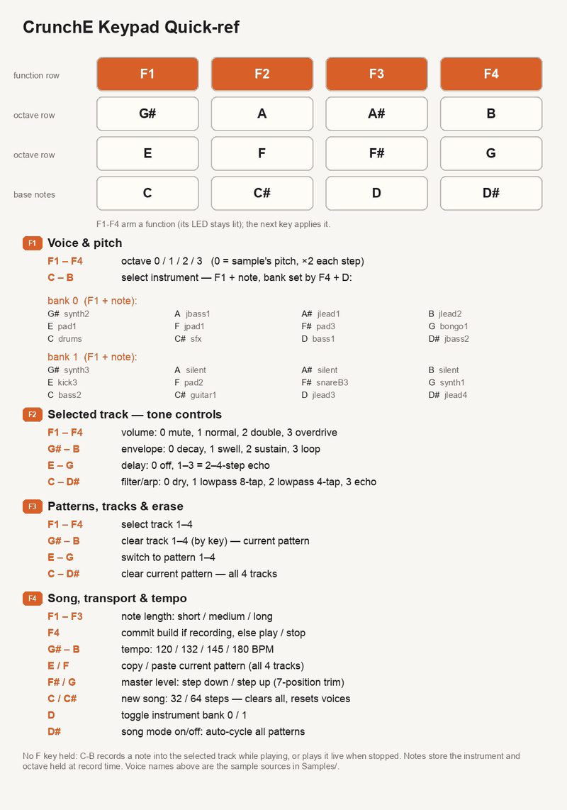

# CrunchOS

[Crunch-E](Schematic_Assembled-CrunchE_2024-06-09.png) is a keychain music-making platform. **CrunchOS** is the open-source firmware: a compact tracker with live overdub, running on ESP32-class hardware.

Current software: **4 tracks**, **4 patterns**, **12 instrument slots per bank** (two banks), live overdub with commit. Bank 0 is drums, SFX, and ten melodic instruments; bank 1 adds nine more melodics (A / A# / B are silent placeholders). One voice per track → 4-note polyphony.

CrunchOS is a sampler/tracker in the spirit of 1990s MOD trackers. Each track plays one note at a time. The keypad is **one key at a time**: press a function key (F1–F4), release it, then press the next key.

The linked schematic is the **upstream commercial board**. DIY electronics assembly (generic ESP32 + modules) is in a later section—those pins need not match the commercial board.

## Function buttons

Pressing a function key lights its LED solid while armed. Choose the second key while that LED is lit (not the slow track blink).

## Key mapping

Note rows (silkscreen): `G# A A# B`, `E F F# G`, `C C# D D#`. Firmware maps bottom→top note rows to inputs `0–3`, `4–7`, `8–11`. The top `F1–F4` row is function inputs `0–3`.

## New song

F4, then C or C#: clear tracks and set pattern length to **32** or **64** steps.

## Play / stop

F4 twice toggles play/stop. **Exception:** if a record session is open, the first F4+F4 **commits** and playback continues—press again to stop. See *Recording notes*.

## BPM

F4, then G# / A / A# / B → **120 / 132 / 145 / 180** BPM.

## Instrument

F1 + a note key selects an instrument in the **current bank** (12 slots: C through B).

F4 + D toggles bank:

- **Bank 0:** C = drums, C# = SFX, D–B = ten melodic instruments
- **Bank 1:** C–G# = nine more melodics; A / A# / B = silent

## Octave

F1, then F1–F4 → octave **0 / 1 / 2 / 3**. (No keypad binding for octave −1.)

## Track volume / overdrive

F2 + F1–F3 sets volume steps; F2 + F4 enables overdrive (extra grit).

## Changing tracks

F3 + F1–F4 selects track 1–4. One voice per track—stack parts on separate tracks. Switching tracks **commits** an open record session.

## Recording notes

With transport running, a note key writes the current 16th-note step on the selected track (live overdub beside other tracks).

- Same step, repeated presses: last press wins.
- Later steps: new notes.
- Instrument and octave at press time are stored in the cell.
- First placed note opens a **record session**; that track’s LED slow-blinks (1 s on / 0.5 s off) while its notes replay.
- **Commit** with F4+F4 (playback continues). Another note opens a new session; commit again, then F4+F4 once more to stop.
- While **stopped**, note keys only audition—they never write the grid.

Native checks: `tests/native/build_input_test.sh`, `tests/native/build_tracker_test.sh`.

## Strip LEDs

- **Solid** function LED = armed for the next key.
- **Slow blink** on a track = that track’s recorded notes are sounding (blink with no audio → check amp/wiring; silent LED → sequencer/content).
- Outside song mode, idle play pulses the selected track on the beat (longer on the downbeat).
- In song mode with the strip otherwise dark, the **current pattern** LED blinks ~4 Hz (waiting, not stuck).

## Clearing a track

F3, then G# / A / A# / B clears track 1 / 2 / 3 / 4 (current pattern).

## Note length (envelope)

F4, then F1 / F2 / F3 selects one of three envelope lengths. (F4+F4 is still commit / play-stop as above.)

## Effects, delay, and envelope shape

F2 + a note key sets per-track tone controls:

- **C–D#:** sample FX — 0 dry, 1–2 low-pass style, 3 echo (not a melodic arpeggio)
- **E–G:** step delay / echo depth (0 = off)
- **G#–B:** envelope shape 0–3 (decay, swell, sustain, loop)

## Patterns and song mode

Four patterns. F3 + E / F / F# / G selects pattern 1–4. F3 + C–D# clears the current pattern (all tracks). F4 + E copies; F4 + F pastes. F4 + D# toggles **this pattern only** vs **all patterns in sequence**. F4 + F# / G steps the master output trim down / up (seven steps around the factory default).

---

## DIY build (generic ESP32)

You can build a playable CrunchOS box from common hobby modules and jumper wires. This is **not** a copy of the commercial Crunch-E board: the [upstream schematic](Schematic_Assembled-CrunchE_2024-06-09.png) is for that product. Here you pick an ESP32 (or ESP32-S3) **dev board**, wire modules to whatever GPIOs you choose, and tell the firmware those pins in `platformio.ini`.

### Parts

| Part | Why you need it |
| --- | --- |
| ESP32 or ESP32-S3 development board | Runs CrunchOS; USB for power and flashing |
| MAX98357A I2S amp **breakout** | Turns digital audio from the ESP32 into speaker-level sound |
| Small speaker (often 4–8 Ω, ~0.5–1 W) | Connects **only** to the amp’s speaker pads—not to the ESP32 |
| Arduino-style **4×4 membrane keypad** | Notes and function keys (F1–F4 + twelve notes) |
| Four ordinary LEDs + four ~100 Ω resistors | Track / function status strip |
| Optional: one WS2812 / NeoPixel | RGB VU meter on `PIN_NEOPIXEL` |
| Breadboard and jumper wires | Prototyping without soldering (or solder later) |

USB cable for your board (data-capable), and **PlatformIO** to build and flash.

### Power and ground (read this first)

- Power the ESP32 from USB while developing. Many amp breakouts take **VIN / VDD** from the same 5 V (or 3.3 V) rail as the board—match the voltage your breakout’s silkscreen allows.
- Tie **every module’s GND** to the ESP32’s GND. One shared ground is required; without it, I2S, LEDs, and the keypad behave randomly.
- Do **not** feed the ESP32’s 3.3 V pin into a breakout that expects 5 V only, and do not reverse VIN/GND.

### Wiring overview

Wire by function: LEDs, keypad, amp (I2S + speaker), optional NeoPixel. Then set the GPIO numbers in `platformio.ini` to match **your** wiring (tables below are one common Super Mini–style default, not mandatory).

### Status LEDs (polarity matters)

CrunchOS drives each strip LED **active-high**: the GPIO goes `HIGH` to light the LED and `LOW` to turn it off.

For each of the four LEDs:

1. Find the **anode** (usually the longer lead; inside the LED, the larger metal piece is often the cathode).
2. GPIO → **resistor (~100 Ω)** → LED **anode**.
3. LED **cathode** → **GND**.

If an LED never lights, swap its leads once—backward LEDs simply stay dark. If it is very dim or the ESP32 resets when it lights, check that a series resistor is present.

| Define | Default GPIO | Role |
| --- | --- | --- |
| `PIN_LED_A` | 1 | Track / function LED A |
| `PIN_LED_B` | 2 | Track / function LED B |
| `PIN_LED_C` | 4 | Track / function LED C |
| `PIN_LED_D` | 8 | Track / function LED D |

### Keypad

A 4×4 membrane keypad is a grid of switches with **eight** pins (four rows, four columns)—no separate power pin. Match the flex ribbon labels to the firmware:

- Rows silkscreen **R4 → R1** (top note row through bottom note row)
- Columns silkscreen **L1 → L4**

| Define | Default GPIO | Silkscreen |
| --- | --- | --- |
| `PIN_KEYPAD_ROW0` | 13 | R4 |
| `PIN_KEYPAD_ROW1` | 3 | R3 |
| `PIN_KEYPAD_ROW2` | 44 | R2 |
| `PIN_KEYPAD_ROW3` | 43 | R1 |
| `PIN_KEYPAD_COL0` | 9 | L1 |
| `PIN_KEYPAD_COL1` | 10 | L2 |
| `PIN_KEYPAD_COL2` | 11 | L3 |
| `PIN_KEYPAD_COL3` | 12 | L4 |

If every key is wrong by a row or column, you almost certainly swapped two ribbon pins—fix the table against the printed letters on the keypad tail.

### NeoPixel (optional)

| Define | Default GPIO | Role |
| --- | --- | --- |
| `PIN_NEOPIXEL` | 48 | Data in (DIN) for the RGB VU / status pixel |

Also connect the pixel’s **5 V** (or VDD) and **GND** to the board. Data alone is not enough. Use a logic-level-friendly pixel; many WS2812 parts expect ~5 V power with data from a 3.3 V ESP32—if it flickers, check your module’s notes.

### Amp and speaker (MAX98357A)

The MAX98357A is a small **Class-D** amp with a built-in I2S DAC: the ESP32 sends digital audio; the chip drives a speaker. It needs **no MCLK** wire and no software “amp setup”—only power, ground, three I2S lines, and the speaker.

**Breakout power**

| Breakout pad | Connect to |
| --- | --- |
| VIN / VDD | Board 5 V or 3.3 V (as allowed by that module) |
| GND | ESP32 GND (shared) |

**I2S from ESP32 → amp** (names on the breakout; three wires + the ground you already shared):

| Define | Default GPIO | Amp pad |
| --- | --- | --- |
| `PIN_I2S_BCLK` | 6 | BCLK |
| `PIN_I2S_WS` | 5 | LRCLK (sometimes labeled WS) |
| `PIN_I2S_DOUT` | 7 | DIN |

Firmware uses standard Philips **I2S**, 16-bit mono at **22 050 Hz**.

**Speaker**

- Connect the speaker to the amp’s **OUT+ / OUT−** (or SPK+ / SPK−) pads only.
- The amp output is **bridge-tied (BTL)**: both speaker wires are driven. There is **no** speaker wire to GND, and this is **not** a headphone / line-out jack for another amp.
- Speaker lead “polarity” only sets absolute phase; either way it will make sound. Keep the wires on the amp pads—never across the ESP32 GPIO pins.

**SD_MODE and GAIN (on many breakouts)**

On the commercial Crunch-E these are fixed on the PCB. On a hobby breakout:

- **SD_MODE** — leave enabled per the module’s silkscreen (often pulled up, or tied for stereo-mix / mono). If the amp stays silent with good I2S wiring, check that SD_MODE is not held in shutdown.
- **GAIN** — sets loudness in hardware (often a solder jumper or floating pad). Firmware does not set gain; change the breakout strap or use CrunchOS master trim (F4 + F# / G) after it boots.

⚠️ **Power budget note (depends on rail voltage and driver rating):** at **5 V** the amp can out-cook small drivers — **~1.8 W** into 8 Ω exceeds both a keychain **0.5 W** unit and a **1 W** part, so the limiter / master trim in CrunchOS are what keep the voice coil safe. At **3.3 V** the amp reaches only **~0.8 W** into 8 Ω: fine and self-limiting for a 1 W driver (the amp, not the speaker, is the ceiling — tune loudness against distortion near max output), but still above a 0.5 W keychain unit’s rating. Which limit binds: **speaker dissipation** (5 V rail), or **amp power** (3.3 V rail with a ≥1 W driver).

Datasheet: <https://www.analog.com/media/en/technical-documentation/data-sheets/max98357a-max98357b.pdf>

### Flash the firmware

1. Install **PlatformIO** and open this repo.
2. Edit `platformio.ini` `build_flags` (`-DPIN_…=`) so every define matches the GPIO you actually wired.
3. Build and upload to the board. `main.cpp` reads those macros—no need to hunt pin numbers in the C++ for a pin remapping.

If LEDs work but there is no sound: confirm amp VIN/GND, the three I2S wires, SD_MODE, and that the speaker is on the amp outputs. If sound works but keys do nothing: re-check keypad row/column pins against the silkscreen table.

---

## Samples

`Samples/*.h` are **generated**—do not edit by hand.

1. `Samples_src/*.wav` — frozen reference PCM (manual upstream import when sources change).
2. `tools/loops.py` — optional register shift / saturation, loop seams (from those wavs each run; does not compound).
3. `tools/gen_headers.py` — writes `Samples/*.h` and `SampleGains.h`.
4. `sh tools/gen_all.sh` — rebuilds artifacts and runs the `verifygen` byte check.

Drop a new WAV into `Samples_src/` and re-run `gen_all.sh`. `tools/` is the sample pipeline; `tests/native/` is the pass/fail test suite.

## Speaker loudness model (theory)

Crunch-E / DIY builds here assume a **small portable driver: roughly 10–50 mm, ≤1 W**—keychain, badge, and pocket speakers, not hi-fi woofers. I’m not an acoustics engineer; the notes below are the research I used to justify a radiated-band loudness model. The **Reference profiles** table after this is separate: those bands and saturate/shift recipes came from **listening and regenerating samples**, not from fitting a lab curve.

The gain table tries to match loudness inside **what the speaker can actually radiate**. Energy far below resonance mostly loads the master limiter without becoming sound; energy above cone break-up just sounds nasty. When you change the transducer, update the model and re-run the gates (`sh tools/gen_all.sh`) so the headers stay byte-exact. `python tools/band_from_curve.py` is there if you *do* have a datasheet curve and want help picking `lo` / `hi`.

### What I took from the literature (F0, response, THD)

**Low edge `lo`.** With a constant drive voltage, cone excursion climbs as frequency falls, then levels off below resonance: Linkwitz puts it as *"Below the driver resonance Fs the excursion X1 becomes constant"* ([Electro-acoustic models](https://www.linkwitzlab.com/models.htm)). Below that point, people who write this stuff carefully treat displacement as roughly frequency-independent for a given force, while radiated pressure follows acceleration—so SPL drops about **12 dB/octave** (∝ f²) ([Munnig Schmidt / RMS Acoustics](https://rmsacoustics.nl/papers/whitepapersoundgeneration.pdf)). That’s the rationale for `BAND_ORDER = 2` on the low skirt: content an octave under `lo` is already ~1/16 the in-band power, which is why tiny speakers make “deep bass” PCM feel quiet even when the waveform looks huge.

If the datasheet has a response curve, I treat `lo` as the −3 dB corner relative to the midband (I used a rough 0.5–2 kHz mean as the reference). If all you have is Fs / F0, using `lo ≈ F0` is a starting guess. Closed-box / 2nd-order high-pass math says that guess is cleanest when Q is near Butterworth (≈0.707), where F3 sits at the natural frequency ([Speakerbench B2](https://speakerbench.com/doc/alignment_theory.html); [AudioCalcs sealed F3](https://audiocalcs.uk/speakers-and-pa/cabinet-volume-calculator/)). Peakier Q (~1.5) can put F3 a bit *below* Fs with a small hump; very damped Q (~0.3) can put F3 well *above* Fs. Cheap 10–50 mm parts rarely publish trustworthy Qts, so I treat F0 as ± a few dB and then **listen**.

**High edge `hi`.** Spec sheets often keep a rising response into the region where the cone is breaking up and THD is already ugly. I take `hi ≈ min(−3 dB corner, where THD crosses a threshold)`. Masking research (Fielder & Benjamin, *JAES* 1988—readable summary on [Audioholics](https://www.audioholics.com/loudspeaker-design/audibility-of-distortion-at-bass)) suggests bass fundamentals hide a lot of low-order harmonics (e.g. at high SPL a 20 Hz tone can mask ~5 % 2nd harmonic but only ~0.4 % 5th), and dense program can hide large peaks—so for this toy amp I use rough working numbers like **~5 % THD near the LF hump** and **~3 % higher up**, then re-check at the real `kMasterDiv` drive level. Those percentages are research-informed seat-of-pants, not a lab standard for keychain speakers.

**Why `SATURATE` shows up on small drivers.** Measurement write-ups (e.g. [Klippel DIS](https://www.klippel.de/manuals/frequencyresponse-distortion/dis/dis.html), [AN 16](https://www.klippel.de/fileadmin/klippel/Files/Know_How/Application_Notes/AN_16_Multi-Tone_Distortion.pdf)) show THD climbing at low frequencies / near resonance from suspension and motor nonlinearities. On a 10–20 mm part that often means the “bass” samples are already dirty *and* under-radiating—so folding some energy up with register shift + mild saturation sounded better on the bench than leaving the PCM pure and quiet. Bigger ~40–50 mm 1 W parts needed less of that; see the experimental table below.

**Tolerance.** I wouldn’t sweat a 20 % error in `lo` for voices that sit well above it; voices that straddle `lo` are the ones that jump when you retune. After any model change: regen, flash, listen. Spreadsheets don’t win that argument.

### References (background reading)

1. S. Linkwitz, [Electro-acoustic models](https://www.linkwitzlab.com/models.htm) — excursion below Fs under constant voltage.
2. R.-H. Munnig Schmidt (RMS Acoustics), [Low Frequency Sound Generation by Loudspeaker Drivers](https://rmsacoustics.nl/papers/whitepapersoundgeneration.pdf) — LF displacement / acceleration → ~12 dB/oct.
3. Closed-box / 2nd-order Q notes: [Speakerbench](https://speakerbench.com/doc/alignment_theory.html), [AudioCalcs](https://audiocalcs.uk/speakers-and-pa/cabinet-volume-calculator/).
4. L. D. Fielder & E. Benjamin, “Subwoofer performance for accurate reproduction of music,” *J. Audio Eng. Soc.*, vol. 36, no. 6, 1988 — LF masking (see also [Audioholics](https://www.audioholics.com/loudspeaker-design/audibility-of-distortion-at-bass)).
5. Klippel, [DIS](https://www.klippel.de/manuals/frequencyresponse-distortion/dis/dis.html); [AN 16](https://www.klippel.de/fileadmin/klippel/Files/Know_How/Application_Notes/AN_16_Multi-Tone_Distortion.pdf) — LF / near-fs THD behavior.

## Tuning (loudness-model knobs)

Aimed at **≤1 W, ~10–50 mm portable** drivers. Knobs first; starting recipes from experimentation next.

| Knob | Where | Meaning |
| --- | --- | --- |
| `SPEAKER_BAND_HZ = (lo, hi)` | `tools/samplelib.py` | Band used for loudness matching. **lo**: usable low end (datasheet −3 dB, or ≈ Fs if that’s all you have). **hi**: before the part turns into buzz—often ~6–8 kHz on micros, a bit higher on larger portable drivers. |
| `BAND_ORDER` | `tools/samplelib.py` | Skirt steepness (2 ≈ 12 dB/oct), matching the 2nd-order LF story above. |
| `TARGET_WRMS` | `tools/samplelib.py` | Relative in-band balance target—not a volume knob. |
| `PEAK_CAP` | `tools/samplelib.py` | Per-voice int16 peak ceiling (default 9000); digital headroom vs the limiter, independent of wattage. |
| `REGISTER_SHIFT`, `SATURATE`, `SAT_DRIVE` | `tools/loops.py` | Octave shift and optional harmonics. Tiny drivers usually want more of this; larger portable ones less. Keep demo octaves in `Tracker.cpp` paired if you change shift. |
| `kMasterDiv`, `kMasterTrimTable` | `OutputMixer.h` | Boot loudness and live F4+F#/G trim—this is where you protect a 0.25–1 W coil from a hot 5 V amp rail. |

### Reference profiles (from experimentation)

These are **bench / ear** starting points for cheap portable drivers in the 10–50 mm, ≤1 W class—not datasheet fits. Pick the row closest to your part, regen, and tweak.

| Driver class | Ballpark Fs | Rating | `SPEAKER_BAND_HZ` | What tended to work |
| --- | --- | --- | --- | --- |
| 10–14 mm keychain / badge | 800–1000 Hz | 0.25–0.5 W | `(600, 6000)` | Heavy `SATURATE` on synths/pads/bass-ish voices, `SAT_DRIVE` 2–3; demo voices often +12 (`REGISTER_SHIFT`). Closest to the original Crunch-E feel. |
| 16–20 mm micro portable | 300–500 Hz | ~0.5 W | `(400, 7000)` | Saturate selectively; try `REGISTER_SHIFT +12` or 0 and keep whichever sounds less thin. |
| 23–40 mm portable | 150–250 Hz | 0.5–1 W | `(250, 8000)` | Often `SATURATE = set()` (off); try shift 0 with demo octaves nudged up. |
| ~40–50 mm small full-range | 80–150 Hz (varies a lot) | ≤1 W | `(150, 9000)`–`(200, 10000)` | Least saturation; trim/`kMasterDiv` matter more than harmonics. Still watch the power-budget note in DIY—5 V amp rails can exceed 1 W into 8 Ω. |

**Wattage vs the digital knobs:** `TARGET_WRMS` / `PEAK_CAP` do **not** encode 0.5 W vs 1 W. Wattage only tells you whether the MAX98357A (≈0.8 W @ 3.3 V, ≈1.8 W @ 5 V into 8 Ω) can cook the coil. For most of these speakers the firmware limiter / `kMasterDiv` is the safety net—especially on USB 5 V with a 0.5 W keychain driver.

### Swap checklist

1. `tools/samplelib.py` — `SPEAKER_BAND_HZ` (and `BAND_ORDER` only if you care); leave `TARGET_WRMS`/`PEAK_CAP` unless you intend to change the digital contract.
2. `tools/loops.py` — `REGISTER_SHIFT` / `SATURATE` from the experimental row (re-pair demo octaves in `Tracker.cpp` if shift moves).
3. `OutputMixer.h` — `kMasterDiv` / trim so a ≤1 W part survives your rail voltage.
4. `sh tools/gen_all.sh`, native gates, flash, listen.

(`docs/InstA.png` is keypad-only. `SampleGains.h` banner text follows whatever `SPEAKER_BAND_HZ` is set to.)

---

**Have fun building, exploring, and making music.**
